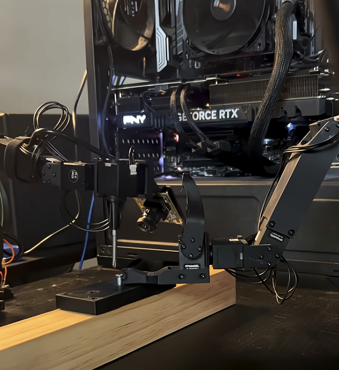
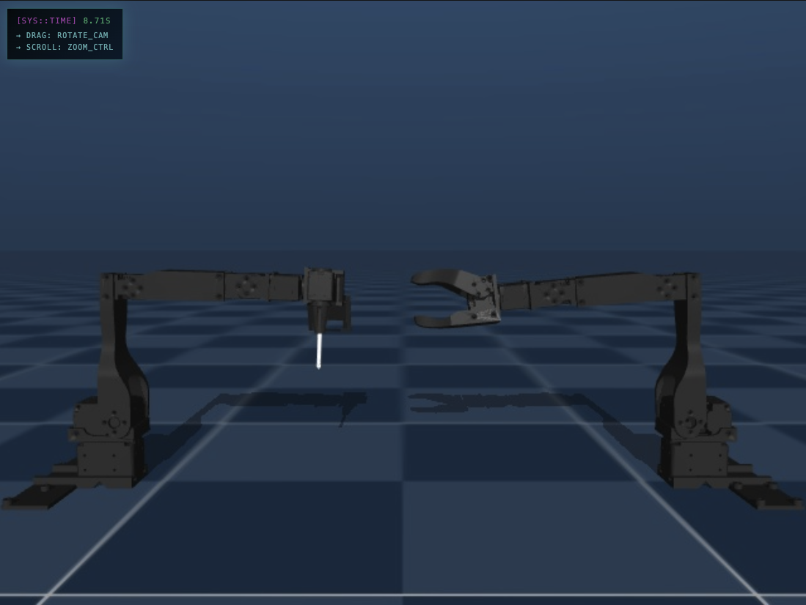

# Assembler 0

An open source low-cost robot designed for assembly tasks. Assembler 0 is a bimanual robot with one arm having a screwdriver manipulator, and the other arm having a gripper with a magnetic-tipped claw for picking up metal screws.

The software is built on top of the [LeRobot](https://github.com/lerobot/lerobot) framework and is designed to be fully compatible with the LeRobot ecosystem and tooling.

The hardware for both arms is based on a modified version of the [Alexander Koch Low Cost Robot](https://github.com/AlexanderKoch-Koch/low_cost_robot).





[Bimanual teleoperation video](https://www.youtube.com/shorts/4DqAzY_f3EI)

## Screwdriver Robot Arm Quick Start Guide
### TL;DR
- Update and run `./calibrate.sh`
- Update and run `./teleoperate.sh`
- Update and run `./record.sh`

### Step 1: Prerequisites
- Python 3.10+
- UV package manager: `curl -LsSf https://astral.sh/uv/install.sh | sh`

### Step 2: Installation
```bash
# Clone the repository
git clone https://github.com/jackvial/assembler0
cd assembler0

# Create a virtual environment with UV
uv venv

# Activate the virtual environment
source .venv/bin/activate

# Install all packages using UV
uv sync
```

### Step 3: Building The Hardware
- Build the base Koch robot see [https://github.com/jess-moss/koch-v1-1](https://github.com/jess-moss/koch-v1-1)
- Print the screwdriver and wrist camera mount see [assembler0-hardware](packages/assembler0-hardware)
- Replace the Koch gripper with the modified camera mount and screwdriver bit holder

### Step 4: Calibration
- Setup the motors and baudrates [LeRobot Koch docs](https://github.com/huggingface/lerobot/blob/main/docs/source/koch.mdx#configure-the-motors) have some good info on this. I personally prefer to use the [Dynamixel Wizard app](https://emanual.robotis.com/docs/en/software/dynamixel/dynamixel_wizard2/) to set the motor baudrate, motor IDs, and test motor connections and positions by turning on and off the Dynamixel motor LEDs.
- Run `./calibrate.sh` to calibrate the robot. Before running:
  - Update servo ports in the script (e.g., `/dev/ttyUSB0`)
  - Set your robot ID (e.g., `my_screwdriver_bot`)
  - Grant port permissions: `sudo chmod 666 /dev/ttyUSB*`
- Once the script starts, instructions will be printed to the terminal on how to calibrate the robot. For the screwdriver robot it's important to consider the difference between the leader arm and the follower arm with the screwdriver, the leader arm reset position will mean the screwdriver on the follower is suspended in the air with the bit pointing towards the base motor.

### Step 5: Teleoperation
- Run `./teleoperate.sh`. You'll need to first update the robot port, camera details, and the robot ID. The robot ID is used to identify your calibration file so it should match the ID you used in the calibration script.
- See LeRobot camera docs [here](https://github.com/huggingface/lerobot/blob/main/docs/source/cameras.mdx) for more info on camera ports.

### Step 6: Record Data
- Run `./record.sh <run_id> <num_episodes>`
  - Example: `./record.sh 0 5` records 5 episodes with run ID 0
  - Update these in the script before running:
    - Robot port (must match calibration)
    - Camera indices (see camera detection above)
    - Dataset repo name (your HuggingFace repo)
    - Task description (what you're recording)
- Recommendation - Record small datasets of 5-10 episodes at a time. The torque/current control is not perfect and the screwdriver robot can stall if the screw gets stuck or you try to overtighten the screw. This will cause the record script to error out and the currently isn't a easy way to recover these episodes or continue from where the script errored out.
- Recommendation - If you make a mistake when recording an episode just leave it in and you can easily remove it later using [LeRobot Data Studio](https://github.com/jackvial/lerobot-data-studio)
- `batch_encoding_size` is set to num_episodes by default. This means encoding will be done at the end of record rather than after each episode. This makes recording data faster for the human operator.
- Recommendation - Use [OBS studio](https://obsproject.com/) to adjust your camera positions and angles.

### Step 7: Merging and Cleaning Data
Your data will likely contain bad episodes where you made a mistake or missed your cue etc... You can use LeRobot Data Studio to merge and clean datasets. See [here](https://github.com/jackvial/lerobot-data-studio). 
Recommended data cleaning workflow:
- Merge your smaller datasets using the LeRobot Data Studio merge feature
- Load the merged dataset into the LeRobot Data Studio data editor and use this to remove the bad episodes

### Step 8: Train a Model
- Follow [LeRobot's IL training guide](https://github.com/huggingface/lerobot/blob/main/docs/source/il_robots.mdx#train-a-policy)
- Recommended model: Action Chunking Transformer (ACT)
- Quick start dataset: [Screwdriver 391](https://huggingface.co/datasets/jackvial/screwdriver-391) (391 curated episodes)

### Step 9: Run Your Trained Policy
⚠️ **Caution:** This will run the model on real robot hardware. Ensure the workspace is clear and be ready to stop the robot if needed.
- Run `./inference.sh` after updating:
  - Model path (local or HuggingFace hub)
  - Robot port (must match calibration)
  - Camera indices
  - Robot ID (must match calibration)

## Assembler 0 System Overview

### Hardware
The hardware package provides 3D-printable parts and CAD designs for the Assembler 0 robot.

**Key Components:**
- Screwdriver manipulator with magnetic bit holder
- Wrist mounted camrea
- Magnetic gripper attachment for screw handling

**Bill of Materials:**
- SVPRO 5MP 30FPS USB Camera ($53.99)
- 6mm × 2mm neodymium magnets (5 pieces)
- Standard 3D printer filament

See the [Hardware Package README](packages/assembler0-hardware/README.md) for detailed printing instructions and assembly guides.

### LeRobot Integration
The robot control software provides complete hardware interfaces and control scripts for the Assembler 0 platform.

**Features:**
- **Robot Implementations:** 
  - KochScrewdriverFollower: 6-DOF arm with screwdriver attachment
  - BiKochScrewdriverFollower: Dual-arm configuration
- **Teleoperation:** Leader-follower control system for data collection
- **Scripts:** Calibration, teleoperation, recording, and inference
- **LeRobot Integration:** Full compatibility with LeRobot policies and training

See the [Robot Package README](packages/assembler0-robot/README.md) for setup and usage instructions.

### Simulator
*Work in progress.*
A MuJoCo-based physics simulator with browser-based interface for testing and development.

**Features:**
- Server-side MuJoCo physics simulation
- Real-time browser-based 3D visualization
- Multi-camera support with configurable viewpoints
- Gamepad control interface
- WebSocket communication for low-latency control

**Requirements:**
- Linux with NVIDIA GPU (EGL rendering support)
- Headless rendering capabilities

See the [Simulator Package README](packages/assembler0-simulator/README.md) for installation and usage.

### Datasets
- [Screwdriver 391](https://huggingface.co/datasets/jackvial/screwdriver_391): 391 curated episodes of screwdriving tasks

# Roadmap
- [x] Hardware for Koch version of the robot
- [x] LeRobot integration for Koch version of the robot
- [x] Hardware for SO101 screwdriver arm
- [ ] LeRobot integration for SO101 version of the robot
- [ ] Hardware for SO101 magnetic tipped gripper arm
- [ ] A dataset of about 600 episodes of Koch + S0101 screwdrivering demonstrations
- [ ] Eval in simulator e.g. [Evaluating Real-World Robot Manipulation Policies in Simulation](https://arxiv.org/pdf/2405.05941)

## Contributing
Contributions are welcome! Please feel free to submit issues and pull requests.

## Citation

If you want, you can cite this work with:

```bibtex
@misc{vial2025assembler0,
  title={Assembler 0: A Low Cost Assembly Robot},
  author={Vial, Jack},
  year={2025},
  howpublished={\url{https://github.com/jackvial/assembler0}},
  note={A low cost assembly robot}
}
```

## License
This project is open source and available under the [MIT License](LICENSE).

## Acknowledgments
- [LeRobot](https://github.com/lerobot/lerobot) framework by HuggingFace
- [Alexander Koch Low Cost Robot](https://github.com/AlexanderKoch-Koch/low_cost_robot) for the base hardware design