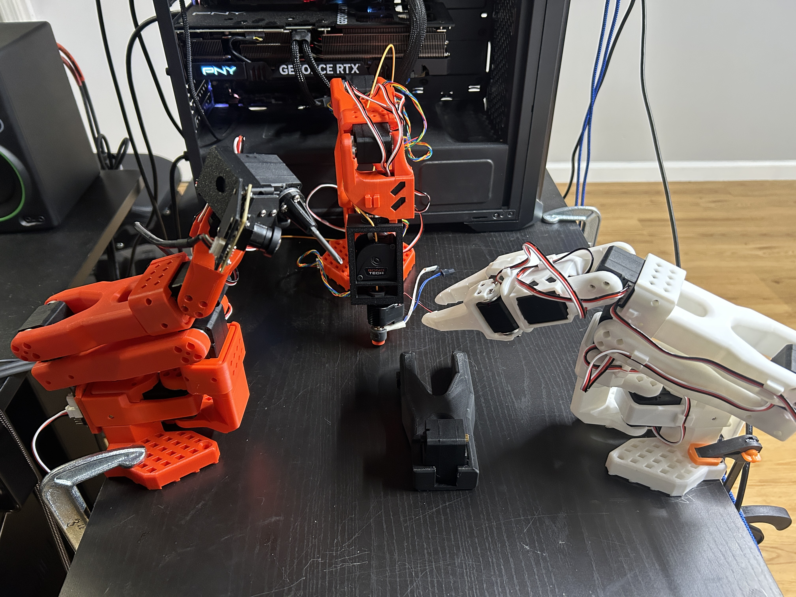

# Assembler 0 - A Self-Replicating Robot Framework'



*A low-cost, open-source robotics platform for researching progressive self-replication and autonomous assembly.*

Assembler 0 is an experimental starting point for a robotic system that can progressively reproduce portions of its own structure. The framework combines low-cost 3D-printed arms, open-source control software, and imitation-learning datasets to explore **partial self-replication** — where structural components can be reproduced internally while relying on externally supplied electronics, actuators, and power.

## Overview

Inspired by the self-replicating machine concepts first proposed by **John von Neumann** and later developed by Freitas and others to macro-kinematic systems[^1], this project builds on recent advances in robotic learning and additive manufacturing. While earlier efforts like the **RepRap Project** achieved partial material replication but not assembly[^2], today's technologies enable new possibilities: policies like ACT[^3] and HIL-SERL[^4] support dexterous manipulation, low-cost 3D-printed robot arms have become accessible, 6DOF robot end-effector-based 3D printing[^5] allows printing complex parts directly from an arm, and tool-using LLMs following the ReACT[^6] paradigm offer high-level reasoning and planning capabilities.

Rather than aiming for full self-replication, Assembler 0 provides a **research and prototyping framework** to study how mechanical, informational, and manufacturing processes can progressively transition from exogenous (externally supplied) to endogenous (internally produced) components.

## System Architecture

### Hardware

A modular three-arm setup based on open, 3D-printable designs:
- **SO101 Gripper Arm** — General assembly manipulation tasks
- **SO101 Screwdriver Arm** — Assembly tasks requiring screwdriving
- **SO101 3D Printer Arm** — For replication of printable structural components *(coming soon)*
- **Bimanual Configuration** — Coordinated teleoperation of gripper and screwdriver arms for complex assembly tasks. The printer arm will operate via preprogrammed G-code tool paths rather than trained policies *(coming soon)*

An earlier prototype was based on Koch's *Low-Cost Robot*[^10], but development has since shifted to the SO101 platform for its superior capability, ease of assembly, and growing community adoption.

All printable components and CAD files are available in [`assembler0-hardware`](packages/assembler0-hardware).

### Software

The control stack builds on LeRobot[^8] for exploring imitation learning and reinforcement learning:

- **SO101 Gripper Arm**: Standard gripper control ([implementation](packages/assembler0-robot/src/assembler0_robot/robots/so101_gripper_follower/so101_gripper_follower.py))
- **SO101 Screwdriver Arm**: Specialized screwdriver manipulation control  ([implementation](packages/assembler0-robot/src/assembler0_robot/robots/so101_screwdriver_follower/so101_screwdriver_follower.py))
- **SO101 3D Printer Arm**: G-code-based control for additive manufacturing *(coming soon)*

See the [robot package documentation](packages/assembler0-robot/README.md) for API details and usage examples.

### Datasets

Training data for imitation learning are stored in **LeRobot** format:

- [**Screwdriver 391**](https://huggingface.co/datasets/jackvial/screwdriver-391) — 391 demonstrations of screwdriving tasks

Tools for dataset management:

- LeRobot Data Studio[^11] — Merge, clean, and visualize datasets
- Recording scripts included in the robot package

## Milestone 1

Freitas & Merkle define the concept of closure in *Kinematic Self-Replicating Machines*[^7].

Assembler 0's first research milestone focuses on demonstrating pathways toward partial closure rather than achieving full closure outright.

| Closure Type | Endogenous (internal) | Exogenous (external) |
|--------------|------------------------|-----------------------|
| **Material** | 3D-printed structural components | Servo motors, screws, wiring, electronics |
| **Energy** | None | Wall power / battery supply |
| **Information/Control** | Autonomous operation via trained policies; preprogrammed 3D-printing toolpaths | Initial training |

**Milestone 1 Goal:**  
Establish a baseline platform capable of complete *information/control closure* and partial *material closure* through 3D-printed mechanical reproduction.  
Energy closure is considered out of scope for this phase.

## Quick Start

### 1. Install

```bash
# Clone the repository
git clone https://github.com/jackvial/assembler0
cd assembler0

# Install the UV package manager
curl -LsSf https://astral.sh/uv/install.sh | sh

# Create a virtual environment and install dependencies
uv venv && source .venv/bin/activate
uv sync
```

### 2. Build Hardware

* Print parts from [assembler0-hardware](packages/assembler0-hardware)
* Follow the SO101 assembly guide[^9] for base arm construction

### 3. Calibrate & Operate

```bash
./so101_calibrate.sh   # set ports, IDs, permissions
./so101_teleoperate.sh # run leader–follower teleop
```

For camera setup, recording workflow, and dataset cleaning, see the [Robot Package README](packages/assembler0-robot/README.md).

## Roadmap

* [x] Koch-based screwdriver arm hardware
* [x] Koch-based screwdriver arm LeRobot integration
* [x] Koch-based gripper arm with magnetic tip hardware
* [x] Koch-based gripper arm with magnetic tip hardware LeRobot integration
* [x] Dataset of 290 screwdriving demonstrations (Koch arm)
* [x] SO101 Screwdriver Arm hardware
* [x] SO101 Screwdriver Arm LeRobot integration
* [x] SO101 Gripper Arm hardware (standard arm hardware)
* [x] SO101 Gripper Arm LeRobot integration (standard SO101 LeRobot integration)
* [ ] SO101 3D Printer Arm hardware (coming soon)
* [ ] SO101 3D Printer Arm control software (G-code driven, planned)

## Contributing

Assembler 0 is an open-ended framework intended for collaborative exploration and incremental contribution.

## License

Released under the [MIT License](LICENSE).

## References

[^1]: [Kinematic Self-Replicating Machines (Freitas & Merkle)](https://www.molecularassembler.com/KSRM/3.13.2.2.htm)
[^2]: [RepRap Project Paper (Jones et al., 2007)](https://reprap.org/mediawiki/images/d/da/Jones-et-al-paper.pdf)
[^3]: [ACT: Action Chunking with Transformers](https://arxiv.org/abs/2304.13705)
[^4]: [HIL-SERL: Human-in-the-Loop Robotic Reinforcement Learning](https://hil-serl.github.io/static/hil-serl-paper.pdf)
[^5]: [6DOF Robot End-Effector-Based 3D Printing](https://www.tandfonline.com/doi/full/10.1080/17452759.2022.2162929)
[^6]: [ReACT: Synergizing Reasoning and Acting in Language Models](https://arxiv.org/pdf/2210.03629)
[^7]: [Kinematic Self-Replicating Machines - Closure](https://www.molecularassembler.com/KSRM/5.6.htm)
[^8]: [LeRobot](https://github.com/huggingface/lerobot)
[^9]: [SO101 Arm Assembly Guide](https://github.com/TheRobotStudio/SO-ARM100)
[^10]: [Koch's Low-Cost Robot](https://github.com/AlexanderKoch-Koch/low_cost_robot)
[^11]: [LeRobot Data Studio](https://github.com/jackvial/lerobot-data-studio)  