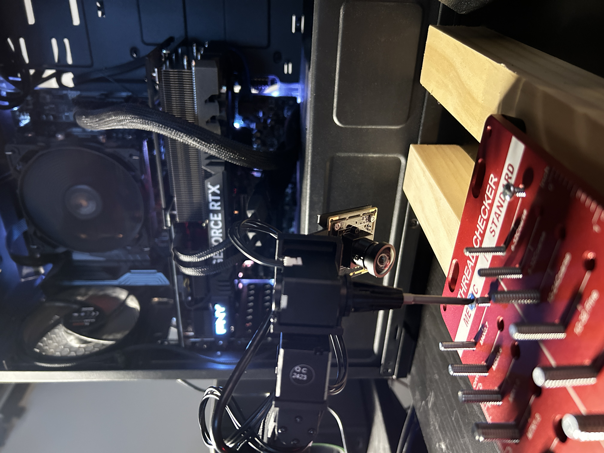
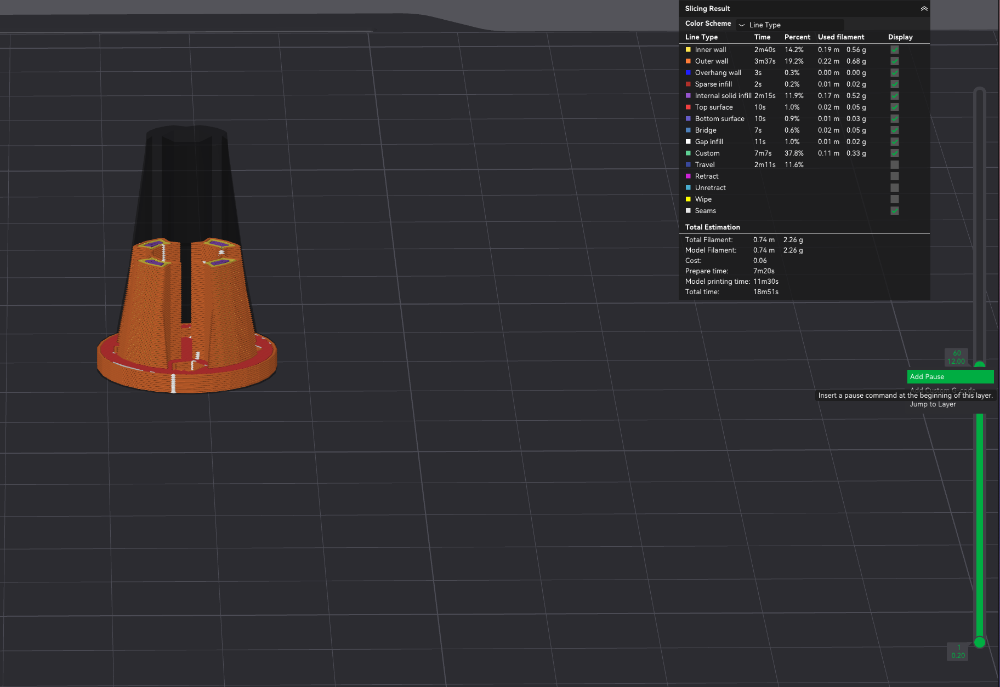

# Assembler0 Hardware

Hardware designs and CAD files for the Assembler 0 robotics platform.

## Overview

This package contains 3D-printable parts and CAD files for the robotic hardware components, including a screwdriver attachment and camera mount for the Koch robotic arm.





## Video Demo
[Watch the demo on YouTube](https://www.youtube.com/shorts/0c0qmF34xng)

## Bill of Materials
* SVPRO 5MP 30FPS USB Camera 
    * $53.99 on [Amazon](https://www.amazon.com/dp/B0D8SS2KNZ?ref_=ppx_hzod_image_dt_b_fed_asin_title_0_0&th=1)
* 6 mm diameter × 2 mm height neodymium magnets — 5 pcs  
    * $5.99 for 50 on [Amazon](https://www.amazon.com/dp/B079FLRQJP?ref=ppx_yo2ov_dt_b_fed_asin_title&th=1)*

## Contents

### CAD Files (`scad/`)
- `koch_screwdriver_chuck.scad` - Screwdriver chuck design
- `magnetic_follower_gripper_static.scad` - Magnetic gripper attachment
- `modified_follower_gripper_static.scad` - Modified gripper variant
- `screwdriver_servo_holder_with_camera_mount.scad` - Servo holder with camera mount

### 3D Models (`stl/`)
- `koch_screwdriver_chuck.stl` - Ready-to-print screwdriver chuck
- `screwdriver_servo_holder_with_camera_mount_v1.2.stl` - Servo holder with camera mount
- `magnetic_follower_gripper_static_v4.stl` - Magnetic gripper attachment
- Additional gripper variants and parts

## Printing Instructions

### Screwdriver Assembly
1. Position both parts on the print bed:  
   • `stl/screwdriver_servo_holder_with_camera_mount_v1.2.stl`  
   • `stl/koch_screwdriver_chuck.stl`
2. In your slicer (e.g. Bamboo Studio for the X1-Carbon) add a pause at the top of the magnet cavity.  
   See this tutorial: https://www.youtube.com/watch?v=SBewgnA0Z2s
3. When the print pauses, insert a stack of 5 magnets into the cavity.
4. Resume printing.

## Installation

This package is part of the Assembler 0 monorepo. Please see the [main repository README](../../README.md#installation) for setup instructions:
- Clone the repository
- Install UV package manager
- Set up virtual environment
- Install all dependencies with `uv sync`

## Usage

The hardware files can be used directly for 3D printing or modified using OpenSCAD for the `.scad` files.

## Citation

If you want, you can cite this work with:

```bibtex
@misc{vial2025assembler0,
  title={Assembler 0: A Low Cost Assembly Robot},
  author={Vial, Jack},
  year={2025},
  howpublished={\url{https://github.com/jackvial/assembler0}},
  note={A low cost assembly robot}
}
```
